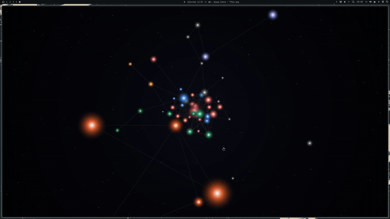

# vault-graph

A live, 3D force-directed graph of an Obsidian vault — notes as nodes, `[[wikilinks]]` as edges — served locally so you can leave it open on a second monitor and watch it move.

No build step, no framework, no dependencies beyond the Python standard library. Point it at a vault folder and run it.



## What it does

- **3D force-directed layout**: the highest-degree note is pinned as a gravitational anchor; every other note orbits it under real inverse-square gravity plus a slow swirl, so the whole graph settles into something that reads as a small galaxy instead of a static tree.
- **Orbit camera**: click-drag empty space to rotate around the anchor, scroll to zoom, real perspective (farther notes shrink and occlude correctly).
- **Folder inspector**: click a folder in the legend to fly the camera in on that folder's cluster and pop open a panel listing its notes — the rest of the graph fades so the selected folder is unambiguous. Click a note in the list to focus it, or its open-in-Obsidian icon to jump straight to editing it there; click the folder again (or the panel's ×) to close.
- **Folder-color legend**: the first 8 top-level folders get distinct colors; everything else (including root-level notes) folds into a shared "Other" bucket.
- **30 color themes**: a built-in default plus 29 real Omarchy palettes (Nord, Gruvbox, Catppuccin, Rosé Pine, and more), picked from the menu and persisted per-browser — no restart needed, no config file to edit.
- **Recency glow**: a note that changed in the last 90 seconds gets a soft white halo, decaying over time — works from file mtimes alone, no extra plumbing required.
- **Activity pulse** *(optional)*: if something reports "I just read/wrote this note" to a small HTTP endpoint, that note (and its edges, and its folder's legend row) pulses in real time — teal for a read, gold with expanding rings for a write. See [Live activity integration](#live-activity-integration-optional) below.
- **Sound** *(optional)*: a wind-chime sample plays on each activity pulse, pitch/pan randomized per event so a burst of activity spreads across the stereo field instead of stacking. Muteable, persisted per-browser.

  🔊 [Watch a short clip with sound](docs/images/audio-demo.mp4) — the hero GIF above is silent; this one has the wind-chime feedback and the live read/write pulse audible together.
- Toggleable on-canvas labels, hover tooltips, click-to-focus neighbor highlighting, an animated starfield backdrop.

## Requirements

- Python 3.9+
- Nothing else. `server.py` is stdlib-only (`http.server`, no pip install).

## Quick start

```bash
git clone https://github.com/r3pc0n/vault-graph.git
cd vault-graph
cp vault-graph.json.example vault-graph.json
```

Edit `vault-graph.json`:

```json
{
  "vault_dir": "/path/to/your/obsidian-vault",
  "port": 8792
}
```

Optional: `"obsidian_vault_name"` — needed only for the "open in Obsidian" links in the folder panel (see below). Obsidian identifies a vault by its *registered name*, not its folder path, and the two are usually but not always the same; this defaults to the vault folder's own name if omitted, which covers most setups. Set it explicitly if you renamed your vault inside Obsidian.

Then run it:

```bash
python3 server.py
```

and open `http://127.0.0.1:8792/`. Pass `--no-open` to skip the automatic browser launch (useful if you're running it as a background service).

`vault-graph.json` is gitignored — it holds a machine-specific absolute path, so it's never meant to be committed.

## How it works

- `server.py` is a `ThreadingHTTPServer` that walks `vault_dir` for `.md` files, extracts `[[wikilinks]]` with a regex, and re-scans only when a file's mtime changes — so polling stays cheap even on a vault with hundreds of notes. It serves the graph as JSON at `/api/graph` and re-reads `index.html` from disk on every request, so front-end edits show up on a browser refresh with no restart.
- `index.html` is a single self-contained canvas page: the physics simulation, rendering, and all UI live in one file, polling `/api/graph` every 2 seconds for structural changes.
- `.obsidian` and `.git` directories inside your vault are skipped automatically.

## Live activity integration (optional)

The graph can react in real time to reads/writes happening elsewhere — originally built for a coding agent's file-access hooks, but the endpoint itself doesn't care who calls it.

`POST /api/activity` with a JSON body:

```json
{"action": "read", "path": "Some Note.md", "timestamp": 1234567890123}
```

- `action` is `"read"` or `"write"`.
- `path` is the note's path relative to `vault_dir`, must end in `.md`.
- `timestamp` is epoch milliseconds (informational — ordering is by server-assigned event id, not this value).

`GET /api/activity?since=<id>` returns every event after that id, so a poller can ask "what happened since I last checked" without missing or double-counting events. Events live in an in-memory ring buffer (last 500), not on disk — they don't need to survive a restart.

### Claude Code integration

`integrations/claude-code/report-vault-activity.sh` is a `PostToolUse` hook that reports `Read`/`Edit`/`Write` tool calls on vault notes to the endpoint above. To use it:

1. Copy or point at `integrations/claude-code/report-vault-activity.sh`.
2. Register it in your project's `.claude/settings.json`:

```json
{
  "hooks": {
    "PostToolUse": [
      { "matcher": "Read",       "hooks": [{ "type": "command",
        "command": "VAULT_GRAPH_CONFIG=/path/to/vault-graph/vault-graph.json /path/to/vault-graph/integrations/claude-code/report-vault-activity.sh" }] },
      { "matcher": "Edit|Write", "hooks": [{ "type": "command",
        "command": "VAULT_GRAPH_CONFIG=/path/to/vault-graph/vault-graph.json /path/to/vault-graph/integrations/claude-code/report-vault-activity.sh" }] }
    ]
  }
}
```

`VAULT_GRAPH_CONFIG` must point at the same `vault-graph.json` your server is running with — the hook reads `vault_dir`/`port` from it so it always agrees with the server about where the vault is. Any other agent or tool that can fire a webhook on file access can talk to the same endpoint the same way; this is just the concrete example.

## License

MIT — see [LICENSE](LICENSE).
